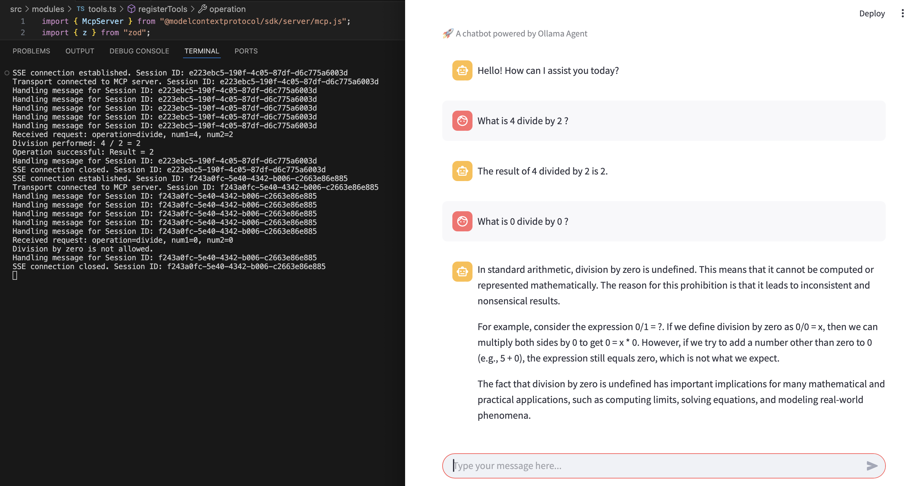

# Ollama Pydantic Project

This project demonstrates how to use a local Ollama model with the Pydantic agent framework to create an intelligent agent. The agent is connected to an MCP server to utilize tools and provides a user-friendly interface using Streamlit.

## Overview

The main goal of this project is to showcase:
- **Local Ollama Model Integration**: Using a locally hosted Ollama model for generating responses.
- **Pydantic Agent Framework**: Creating an agent with Pydantic for data validation and interaction.
- **MCP Server Connection**: Enabling the agent to use tools via an MCP server.
- **Streamlit UI**: Providing a web-based chatbot interface for user interaction.

## Prerequisites

Before setting up the project, ensure the following:

1. **Python**: Install Python 3.8 or higher. You can download it from [python.org](https://www.python.org/).
2. **Ollama Model**: Install and run the Ollama server locally:
   - Download the Ollama CLI from [Ollama's official website](https://ollama.ai/).
   - Install the CLI by following the instructions provided on their website.
   - Start the Ollama server:
     ```bash
     ollama serve
     ```
   - Ensure the server is running on `http://localhost:11434/v1`.
3. **MCP Server**: Set up an MCP server to enable agent tools. For more details, refer to [MCP Server Sample](https://github.com/jageenshukla/hello-world-mcp-server).

## Setup Instructions

Follow these steps to set up the project:

1. **Clone the Repository**:
   ```bash
   git clone <repository-url>
   cd ollama-pydantic-project
   ```

2. **Create a Virtual Environment**:
   ```bash
   python3 -m venv venv
   ```

3. **Activate the Virtual Environment**:
   - On macOS/Linux:
     ```bash
     source venv/bin/activate
     ```
   - On Windows:
     ```bash
     venv\Scripts\activate
     ```

4. **Install Dependencies**:
   ```bash
   pip install -r requirements.txt
   ```

5. **Ensure the Ollama Server is Running**:
   Start the Ollama server as described in the prerequisites.

6. **Run the Application**:
   Start the Streamlit application:
   ```bash
   streamlit run src/streamlit_app.py
   ```

## Usage

Once the application is running, open the provided URL in your browser (usually [http://localhost:8501](http://localhost:8501)). You can interact with the chatbot by typing your queries in the input box. The agent will process your queries using the Ollama model and tools provided by the MCP server.

### Example Interaction

Below is an example of how the chatbot interface looks when interacting with the agent:



## Project Structure

The project is organized as follows:

```
ollama-pydantic-project/
├── src/
│   ├── streamlit_app.py        # Main Streamlit application
│   ├── agents/
│   │   ├── base_agent.py       # Abstract base class for agents
│   │   ├── ollama_agent.py     # Implementation of the Ollama agent
│   ├── utils/
│       ├── config.py           # Configuration settings
│       ├── logger.py           # Logger utility
├── requirements.txt            # Python dependencies
├── README.md                   # Project documentation
├── assets/
│   ├── ollama_agent_mcp_example.png  # Example interaction image
├── .gitignore                  # Git ignore file
```

## Features

- **Streamlit Chatbot**: A user-friendly chatbot interface.
- **Ollama Model Integration**: Uses a local Ollama model for generating responses.
- **MCP Server Tools**: Connects to an MCP server to enhance agent capabilities.
- **Pydantic Framework**: Ensures data validation and type safety.

## Troubleshooting

- If you encounter issues with the Ollama server, ensure it is running on `http://localhost:11434/v1`.
- If dependencies fail to install, ensure you are using Python 3.8 or higher and that your virtual environment is activated.
- For MCP server-related issues, refer to the [MCP Server Sample](https://github.com/jageenshukla/hello-world-mcp-server).

## License

This project is licensed under the MIT License. See the LICENSE file for details.

## Contributing

Contributions are welcome! Feel free to open issues or submit pull requests.